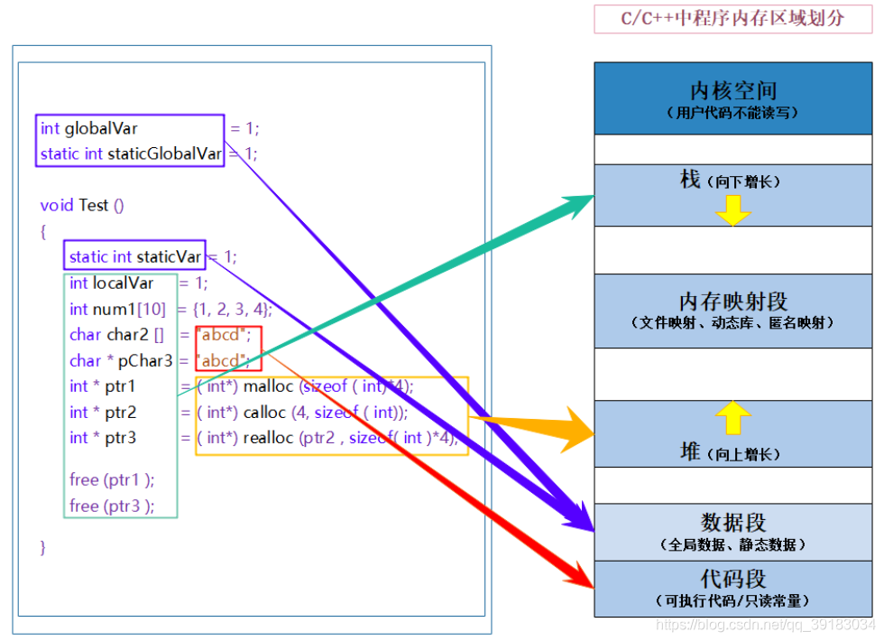

# Cpp_learning

用于C++项目分享中的知识点记录........

Git学习文档：[添加远程库 - 廖雪峰的官方网站 (liaoxuefeng.com)](https://www.liaoxuefeng.com/wiki/896043488029600/898732864121440)

开源项目汇总-持续更新：

- [Light-City/CPlusPlusThings: C++那些事 (github.com)](https://github.com/Light-City/CPlusPlusThings)
- [taylorconor/tinytetris: 80x23 terminal tetris! (github.com)](https://github.com/taylorconor/tinytetris)

学习路线：STL `->`  C++11 `->`  设计模式

## MytinySTL

> 项目地址：[Alinshans/MyTinySTL: Achieve a tiny STL in C++11 (github.com)](https://github.com/Alinshans/MyTinySTL)
>
> 参考书籍：STL源码剖析
>
> 学习目标：熟练掌握常用容器和算法的使用，分析其设计方式和代码原理。

**Test**       	         // 测试文件夹，代码分析完成情况如下

- [x] test.cpp      // 程序入口
- [x] algorithm_performance_test.h
- [x] algorithm_test.h
- [x] deque_test.h
- [x] list_test.h
- [x] map_test.h
- [x] queue_test.h
- [x] set_test.h
- [x] stack_test.h
- [x] string_test.h
- [x] test.h
- [x] unordered_map_test.h
- [x] unordered_set_test.h
- [x] vector_test.h
- [x] CMakeLists.txt

**MyTinySTL**   //STL实现文件夹

 - [ ] algo.h
 - [ ] allocator.h
 - [ ] deque.h 
 - [x] algorithm.h
 - [x] astring.h
 - [ ] construct.h
 - [x] util.h   这个文件包含一些通用工具，包括 `move, forward, swap` 等函数，以及 `pair` 等 
 - [x] type_traits.h   作者未做实现，使用的是标准库里的`type_traits`

## C++ 新特性

### C++11

- `NULL`,`nullptr`

- `constexpr`

  > `const`既可修饰只读变量，也可修饰常量
  >
  > `constexpr`只用于修饰常量表达式

 - `auto`:用于自动推导已经被初始化后的变量的类型
 - `decltype`:用于自动类型推导,语法为 `
   int a=10; decltype(a) b = 100;`  主要应用于泛型编程中
- `noexcept`

- `&&`:右值引用

- 转移和完美转发：`std::move，std::forward`

- `final`

- `override`

- `默认模板参数`：c++11中允许模板有默认参数

- `using`：定义类型的别名，可以给模板定义别名而`typedef`不行。

### C++14

### C++17

### C++20

## 设计模式

## 内存相关
 
## 零散知识点

- **`typedef` 和 `typename`:**

  >  `typedef` 用来定义别名，`typename`用来告诉编译器后面的东西为一个类型即`type`

- **拷贝构造和拷贝赋值**

  > 拷贝赋值用于赋值。
  >
  > ```c++
  > Person p;
  > Person p1;
  > p = p1;//此时调用拷贝构造函数
  > ```
  >
  > - 初始化是对于一个新的对象来说的，在构造这个对象的时候，给这片内存一个初始值
  > - 赋值是对于一个已经存在的对象来说的，给一个已经存在的对象重新覆盖值

  > 拷贝构造的调用有如下几个场景：
  >
  > - 用`=`初始化一个新的类： `Person p = p1;`，此时的`=`代表初始化，并非赋值。
  >
  > - 显示调用拷贝构造函数来初始化一个新的类：`Person p(p1)`
  >
  > - 函数传参时，传入一个类的实参会导致拷贝构造生成一个临时对象：
  >
  >   ```c++
  >   void f(Person p1) { ... }
  >   Person p;
  >   f(p)
  >   ```

- **c++在函数后加const的意义：**

  > 我们定义的类的[成员函数](https://so.csdn.net/so/search?q=成员函数&spm=1001.2101.3001.7020)中，常常有一些成员函数不改变类的数据成员，也就是说，这些函数是"只读"函数，而有一些函数要修改类数据成员的值。如果把不改变数据成员的函数都加上const关键字进行标识，显然，可提高程序的可读性。其实，它还能提高程序的可靠性，**已定义成const的成员函数，一旦企图修改数据成员的值，则编译器按错误处理**。 const成员函数和const对象 实际上，const成员函数还有另外一项作用，即常量对象相关。对于内置的数据类型，我们可以定义它们的常量，用户自定义的类也一样，可以定义它们的常量对象。
  > 1、非静态成员函数后面加const（加到非成员函数或静态成员后面会产生编译错误）
  > 2、表示成员函数隐含传入的this指针为const指针，决定了在该成员函数中， 任意修改它所在的类的成员的操作都是不允许的（因为隐含了对this指针的const引用）；
  > 3、唯一的例外是对于mutable修饰的成员。加了const的成员函数可以被非const对象和const对象调用，但不加const的成员函数只能被非const对象调用


