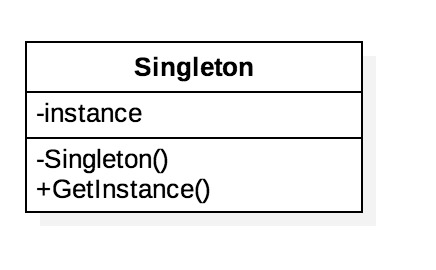

> 参考资料：    
>[1] https://subingwen.cn/design-patterns/#%E8%AE%BE%E8%AE%A1%E6%A8%A1%E5%BC%8F-%E6%B5%B7%E8%B4%BC%E7%8E%8B%E7%89%88      

## 1.单例模式     



在一个项目中，全局范围内，某个类的实例有且仅有一个，通过这个唯一实例向其他模块提供数据的全局访问，这种模式就叫单例模式。

由于类的实例全局唯一，因此不支持在类外创建新的实例，所以需要手动在类里禁用掉默认的拷贝构造和拷贝赋值函数，防止使用者调用生成新的类实例。禁用的方式有两种，一种是直接显示的删除在`public`中使用`= delete`来删除，第二种方式就是将拷贝构造和拷贝赋值函数声明为私有的。

同时需要创建全局唯一的实例，  因此在类中声明一个**静态变量指针**来存储这个实例，类中的静态变量成员不能在类中赋值，需要在类外赋值初始化。当这个指针在类加载时直接初始化了就是饿汉模式，类指针在加载时被声明为`nullptr`则是懒汉模式。

### 1.1 饿汉模式

```c++
// 饿汉模式
class TaskQueue
{
public:
    // = delete 代表函数禁用, 也可以将其访问权限设置为私有
    TaskQueue(const TaskQueue& obj) = delete;
    TaskQueue& operator=(const TaskQueue& obj) = delete;
    static TaskQueue* getInstance()
    {
        return m_taskQ;
    }
private:
    TaskQueue() = default;
    static TaskQueue* m_taskQ;
};
// 静态成员初始化放到类外部处理
TaskQueue* TaskQueue::m_taskQ = new TaskQueue; //直接创建全局唯一实例

int main()
{
    TaskQueue* obj = TaskQueue::getInstance();
}
```

### 1.2 懒汉模式

```c++
// 懒汉模式
class TaskQueue
{
public:
    // = delete 代表函数禁用, 也可以将其访问权限设置为私有
    TaskQueue(const TaskQueue& obj) = delete;
    TaskQueue& operator=(const TaskQueue& obj) = delete;
    static TaskQueue* getInstance()
    {
        if(m_taskQ == nullptr)
        {
            m_taskQ = new TaskQueue;
        }
        return m_taskQ;
    }
private:
    TaskQueue() = default;
    static TaskQueue* m_taskQ;
};
TaskQueue* TaskQueue::m_taskQ = nullptr; //初始化为nullptr
```

在调用` getInstance() `函数获取单例对象的时候，如果在单线程情况下是没有什么问题的，如果是多个线程，调用这个函数去访问单例对象就有问题了。假设有三个线程同时执行了`getInstance()` 函数，在这个函数内部每个线程都会 new 出一个实例对象。此时，这个任务队列类的实例对象不是一个而是 3 个，很显然这与单例模式的定义是相悖的。

#### 1.2.1 线程安全问题

对于饿汉模式是没有线程安全问题的，在这种模式下访问单例对象的时候，这个对象已经被创建出来了。要解决懒汉模式的线程安全问题，最常用的解决方案就是使用互斥锁。
